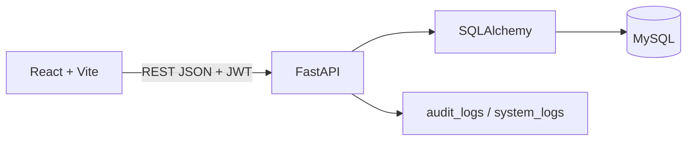

# Arquitectura

## Arquitectura General

El frontend consume una API REST JSON real mediante Axios. El backend centraliza autenticacion, autorizacion, reglas de negocio y transacciones. MySQL conserva usuarios, catalogo, carrito, pedidos, pagos simulados, inventario, finanzas, configuracion, resenas y bitacoras.

## Separacion

- `frontend/src`: componentes, paginas, rutas, contexto de autenticacion, cliente API y estilos.
- `backend/app/api`: routers REST por dominio.
- `backend/app/core`: configuracion, base de datos y seguridad.
- `backend/app/models`: entidades SQLAlchemy.
- `backend/app/schemas`: contratos Pydantic.
- `backend/app/services`: auditoria y registros.
- `database`: esquema, seed y respaldo local.

## Preparacion Para Produccion

- Variables por `.env` y `.env.example`, sin credenciales reales en codigo.
- CORS configurable por entorno.
- JWT con secreto externo.
- Cabeceras de seguridad y preparacion HSTS cuando la peticion sea HTTPS.
- Docker Compose local para MySQL; backend y frontend pueden contenedorizase despues sin cambiar contratos.

## Decisiones Tecnicas

- FastAPI por velocidad de desarrollo, OpenAPI automatico y validacion fuerte.
- SQLAlchemy para mantener reglas transaccionales en servicios y consultas mantenibles.
- MySQL 8 como base principal por integridad referencial y compatibilidad academica.
- Pago simulado local con estados `aprobado`, `rechazado`, `pendiente`.
- Exportacion PDF como HTML imprimible local documentado para evitar dependencia pesada.
- Audit logs para operaciones criticas y system logs para observabilidad basica.

